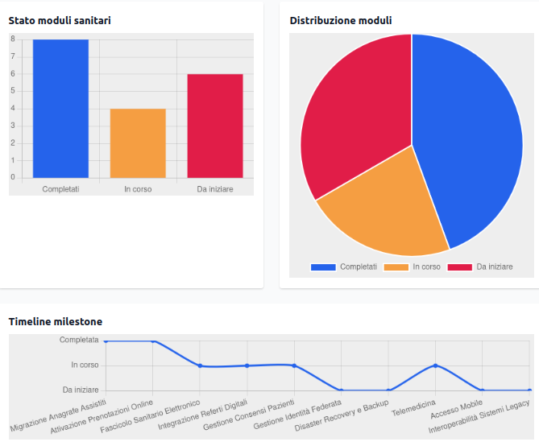

[](https://github.com/AntoninoMirabile/PSNpulse/actions)

# PSN Pulse

@docs



## Cos'è PSN Pulse?

**PSN Pulse** è una dashboard per Pubbliche Amministrazioni che monitora l'avanzamento della migrazione dei dati e dei sistemi verso il cloud nazionale (PSN). Permette di:
- Visualizzare lo stato di avanzamento della migrazione
- Identificare aree critiche e milestone
- Monitorare rischi di cybersecurity
- Inviare dati di test e simulare scenari

## Flusso Utente

1. **Login**: Inserisci la tua API Key (per test: `psn-pulse-dev-2024`)
2. **Dashboard**: Visualizza lo stato della migrazione, milestone, aree critiche, rischi e invia dati di test
3. **Guida**: Sempre accessibile tramite il bottone in alto
4. **Logout**: Esci in ogni momento dal menu in alto

## Sezioni della Dashboard

- **Progresso Migrazione**: Barra e percentuale che rappresentano l'avanzamento reale della migrazione dati/sistemi verso il cloud PSN
- **Aree Critiche**: Elenco delle aree che richiedono attenzione, con spiegazione
- **Milestone**: Timeline delle tappe principali (es. setup infrastruttura, import dati, sicurezza)
- **Rischi Cybersecurity**: Stato attuale, vulnerabilità note, suggerimenti
- **Azioni Rapide**: Invia dati di test, scarica report, simula criticità
- **Guida Rapida**: Istruzioni, payload di esempio, link API

## Esempi di Payload

### Sanity Module (POST /health-data)
```json
{
  "record_id": "rec-001",
  "data_type": "patient_record",
  "content": {
    "patient_name": "Mario Rossi",
    "dob": "1980-01-01",
    "diagnosis": "Ipertensione"
  },
  "patient_id": "pat-123",
  "facility_id": "osp-001"
}
```

### Cybersecurity Tracker (GET /security-risks)
```
GET /security-risks
Header: X-API-Key: psn-pulse-dev-2024
```

### Interoperability Tool (POST /health-data)
```
POST /health-data
Header: X-API-Key: psn-pulse-dev-2024
Body: { ... }
```

## Guida Rapida (accessibile in app)
- Accedi con API Key di test: `psn-pulse-dev-2024`
- Visualizza stato, rischi, milestone
- Invia dati di test o simula scenari
- Consulta la guida in ogni momento dal bottone in alto
- Esci con il logout dal menu

## Roadmap
- [x] Miglioramento UX e onboarding
- [x] Guida rapida sempre accessibile
- [x] Logout e flusso utente chiaro
- [ ] Multi-tenant per PA
- [ ] Integrazione API reali